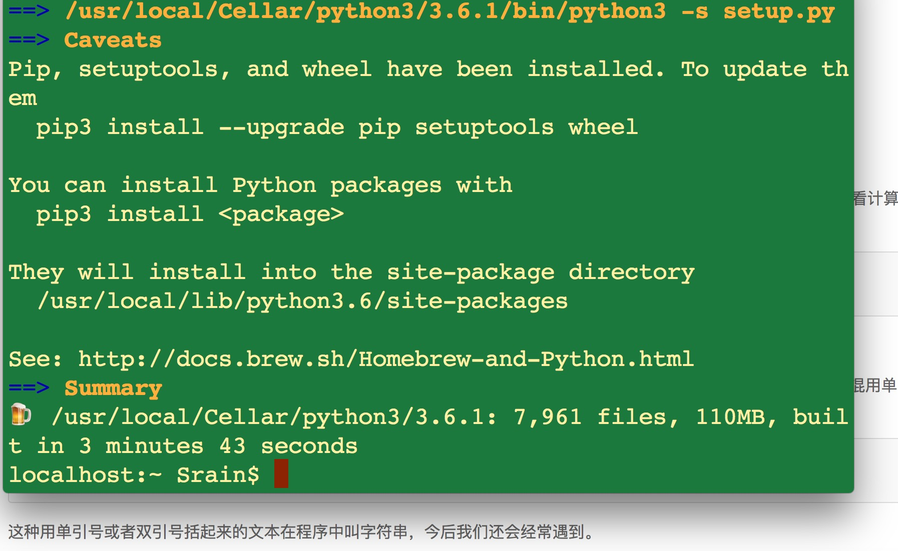

# Python

## install Python3 for Mac

- 从Python官网下载Python 3.X的安装程序（网速慢的同学请移步国内镜像），双击运行并安装；

- 如果安装了Homebrew，直接通过命令`brew install python3`安装即可。

- 在Mac和Linux上运行Python时，请打开终端，然后运行`python3`

## web Site 

- [python.org](https://docs.python.org/3/)

- [liaoxuefeng](http://www.liaoxuefeng.com/wiki/0014316089557264a6b348958f449949df42a6d3a2e542c000)

